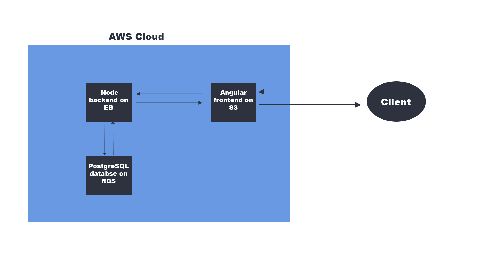

# Infrastructure description

## AWS services in use

- **RDS**
  - provides PostgreSQL database
- **S3**
  - provides the frontend hosting
- **Elastic Beanstalk**
  - provides the backend hosting

## Infrastracture Diagram

